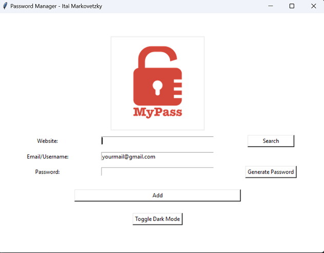
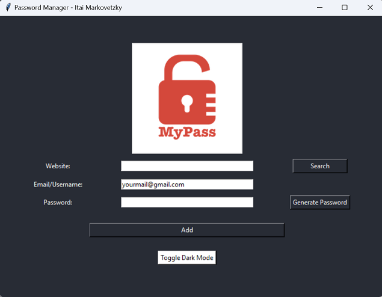

# Password Manager

A simple password manager application with features for generating, saving, and searching passwords.

## Table of Contents

- [Features](#features)
- [Installation](#installation)
- [Usage](#usage)
- [Dark Mode](#dark-mode)
- [How It Works](#how-it-works)
- [Screenshots](#screenshots)

## Features

1. **Password Generation:** Generate strong passwords with a mix of letters, numbers, and symbols.
2. **Password Saving:** Save website details, including email/username and password securely.
3. **Password Searching:** Search and retrieve saved passwords for specific websites.
4. **Master Password:** Protect your stored passwords with a master password.
5. **Dark Mode:** Toggle between light and dark modes for personalized preferences.

## Installation

1. Clone the repository.
2. Navigate to the project directory.
3. Install the required dependencies.

## Usage

1. Run the password manager.
2. Use the provided buttons to generate passwords, save new entries, and search for existing passwords.

## Dark Mode

To toggle between light and dark modes, use the "Toggle Dark Mode" button. Customize the color values in the `toggle_dark_mode` function in the code to match your preferred dark mode theme.

## How It Works

The password manager stores and retrieves data using a JSON file (`data.json`). Here's a brief overview:

- **Password Saving:**
  - When you save a new password, the application reads the existing data from `data.json`.
  - It then updates the data with the new entry (website, email, and password).
  - The updated data is written back to `data.json`.

- **Password Searching:**
  - When you search for a password, the application reads the data from `data.json`.
  - It checks if the requested website exists in the data.
  - If found, it displays the associated email and password.

- **Master Password:**
  - The master password (hashed for security) is used to protect access to the stored passwords.
  - When searching for a password, the master password is required to verify access.

## Screenshots

### Light Mode

### Dark Mode

